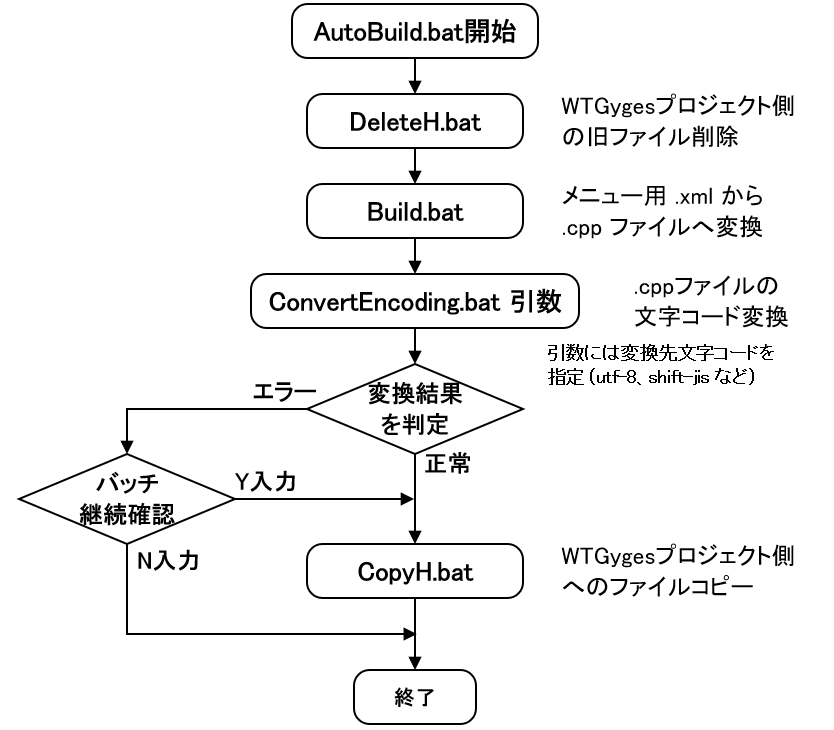

# EncodingConverter 操作マニュアル（コンソール/GUI 共通版）

## はじめに

本ドキュメントでは、メニュー生成に関わる一連のバッチ処理を改善する目的で開発された文字コード変換ツール「**EncodingConverter**」の導入背景と使い方を整理します。

従来の運用では、以下のような手順で `.cpp` ファイルが生成・配置されていました：

- AutoBuild.bat を起点に、DeleteH.bat → Build.bat → CopyH.bat の順に処理を実行し、
- メニュー画面定義の `.xml` を `.cpp` に変換後、プロジェクト所定のフォルダへファイルを配置

この流れの中で、**生成された `.cpp` ファイルの文字コード変換（例：UTF-8化）は手作業で行う必要があり、変換し忘れによる Shift-JIS 混在ファイルのコミットが起こることもありました**。Shift-JIS のままでもビルドが通ってしまうため、**誤った文字コードのままリポジトリに混入してしまうリスク**が存在していました。

この問題を解決するため、本ツール **EncodingConverter** が開発され、AutoBuild.bat に組み込むことで一連処理の中に組み込まれるようになりました。

本ツールは、以下の2つの操作モードを備えており、用途や運用体制に応じて柔軟な活用が可能です：

- **🖥 コンソール実行モード**  
  自動化・バッチ処理環境に適した非対話形式。CI/CD やバッチ化されたビルドフローに統合しやすい構造です。

- **🪟 GUI 操作モード**  
  手動での確認、変換対象ファイルのドラッグ＆ドロップ操作、変換ログの視認など、直感的な操作性を提供します。特に誤ったファイルリスト（`ConvertTargetFileList.csv`）を素早く作成し直す目的でも便利です。

本マニュアルでは、両モードの運用を1つのドキュメントに統一し、以下のような構成で操作手順・出力内容・対処方法などを整理します：

1. コンソール操作編（AutoBuild.bat を使った一括処理）  
2. GUI 操作編（ファイルリスト編集・変換・ログ確認）  
3. 共通の出力ファイル、ログ、エラー対応  
4. バッチ実行フロー図・構成の可視化

それぞれのセクションは、**実際の出力や画面仕様、ユーザ導線に即して構成**されており、運用・保守の効率化とトラブル時の即応力を向上させることを目的としています。

## 1. コンソール操作編（AutoBuild バッチによる一括処理）

EncodingConverter は、主にバッチファイルを通じてコマンドラインから実行されることを想定した構成となっており、連携する複数の `.bat` ファイルにより以下のようなシーケンスで実行されます。

### 1.1 実行構成概要

```
AutoBuild.bat
 ├─ DeleteH.bat
 ├─ Build.bat
 ├─ ConvertEncoding.bat [引数: utf-8 など]
 └─ CopyH.bat（エラーなしで自動／エラーありでユーザ確認）
```

> 🔍 各バッチの役割や分岐については、付録の処理シーケンス図をご参照ください。

---

### 1.2 各バッチファイルの役割

| バッチ名              | 役割                                                                 |
|------------------------|----------------------------------------------------------------------|
| `DeleteH.bat`          | メニュー生成ツールが以前出力したファイルを削除し、再生成前の状態をクリア       |
| `Build.bat`            | メニュー生成ツールの `.exe` を起動して、指定 XML から `.cpp` ファイルを生成     |
| `ConvertEncoding.bat`  | 文字コード変換を実行（`ConvertTargetFileList.csv` に基づく）               |
| `CopyH.bat`            | `.cpp/.h` ファイルを WTGyges プロジェクトの所定ディレクトリへコピー（※変換成功時は自動、失敗時はユーザ確認） |

---

### 1.3 変換モードの指定方法

`AutoBuild.bat` は `ConvertEncoding.bat` を小文字の引数で呼び出します。指定可能な変換先文字コードは以下の通りです：

| 変換先文字コード | 説明         |
|------------------|--------------|
| `shift-jis`      | Shift_JIS    |
| `iso-2022-jp`    | ISO-2022-JP  |
| `euc-jp`         | EUC-JP       |
| `utf-8`          | UTF-8（推奨） |

`AutoBuild.bat` 側では、これらの文字コードを単独で引数として指定します。

また、変換中のログを抑制するための **`--quiet` オプション** は、`ConvertEncoding.bat` 側でのみ制御可能です。  
そのため、**実行中にログを表示させたい場合は、`ConvertEncoding.bat` 側で `--quiet` を付けないように調整してください。**


```bat
CALL ConvertEncoding.bat utf-8
```

---

### 1.4 変換エラー時のユーザ確認メッセージ

`ConvertEncoding.bat` 内で変換エラーが発生した場合、以下の確認プロンプトが表示され、次の処理（`CopyH.bat`）を行うか判断が求められます：

```
バッチを終了しますか？ [Y,N]?
```

#### なぜこの確認が必要なのか？

- `Build.bat` により生成された `.cpp/.h` ファイルは、変換に失敗した状態では不整合な可能性あり
- `CopyH.bat` により WTGyges プロジェクトにコピーされると、ビルドエラーや想定外の動作を招く恐れがある
- よって、**変換が失敗したまま不完全なファイルをコピーしないよう、安全確認としてこのプロンプトが表示されます**

| 入力 | 処理内容 |
|------|----------|
| `Y` | バッチ実行を終了（CopyH.bat は実行されない） |
| `N` | CopyH.bat を実行し、ファイルコピーを継続する |

---

### 1.5 実行例：AutoBuild.bat の呼び出しログ（概要）

```text
■ AutoBuild バッチ実行開始
→ ConvertEncoding.bat shift-jis はスキップ (実行する場合はAutoBuild.batのremコメントアウトを削除)
→ DeleteH.bat 実行
→ Build.bat 実行（メニュー生成ツール起動）
→ ConvertEncoding.bat utf-8 実行 (文字コード変換開始)
→ [変換結果に応じてコンソールにログ出力]
→ CopyH.bat 実行またはスキップ（ユーザ選択）
■ バッチ処理完了
```

次章では、`ConvertEncoding.bat` の単体実行により発生するコンソール出力例とそのエラー時対応を詳しく解説します。


## 2. コンソール出力とエラー時の対応

本章では、`ConvertEncoding.bat` の実行時に表示されるコンソール出力の具体例と、それぞれのメッセージに対してユーザが取るべき対応について整理します。

---

### 2.1 正常終了時の出力

```
utf-8への文字コード変換が正常終了しました。
```

- 変換対象ファイルすべてに対し変換が成功したことを表します。
- ログファイル（例：`Conv_20250626-155923.log`）に処理詳細が記録されています。
- `.errors.csv` は出力されません。

---

### 2.2 エラーまたは一部スキップ時の出力例と対応

| 種別 | 出力メッセージ | 対応内容 |
|------|----------------|----------|
| ⚠️ 一部ファイルがスキップされた場合 | utf-8への文字コード変換は成功しましたが、スキップされたファイルがあります。<br>文字コード変換スキップされたファイルは ..\..\Tool\EncodingConverter\bin\ConvertTargetFileList.errors.csv を確認してください。 | `.errors.csv` を開いてファイル名とスキップ理由を確認<br>→ GUIで再確認・調整が可能 |
| ❌ 設定ファイル読込エラー | utf-8への文字コード変換用の設定ファイル読み込みに失敗しました。<br>文字コード変換設定ファイル ..\..\Tool\EncodingConverter\bin\EncodingConverterConfig.xml の指定誤りがないかを確認してください。 | XMLの構文エラー・存在確認・パス設定ミスのチェック |
| ❌ コマンドライン引数エラー | utf-8への文字コード変換用のコマンドライン引数解析に失敗しました。 | `ConvertEncoding.bat` の呼び出し引数や構成ミスを修正 |
| ❌ ファイルリストが見つからない | utf-8への文字コード変換用の変換対象ファイルリストが見つかりませんでした。<br>文字コード変換対象ファイルリスト保存ファイル ..\..\Tool\EncodingConverter\bin\ConvertTargetFileList.csv の指定誤りがないかを確認してください。 | ファイル名・ディレクトリ指定・拡張子などを確認 |
| ❌ 通常変換エラー | utf-8への文字コード変換に失敗しました。 | 処理中にエンコーディング不可な内容が含まれていた可能性<br>→ `.errors.csv` と `.log` を参照して確認 |
| ❌ 異常終了 | utf-8への文字コード変換が異常終了しました。<br>文字コード変換対象ファイルリスト保存ファイル ..\..\Tool\EncodingConverter\bin\ConvertTargetFileList.csv の指定誤りがないかを確認してください。 | OSレベルまたは実行環境側の問題も含めてログを調査 |

---

### 2.3 `.errors.csv` の構成と活用

変換スキップ／エラーが発生した場合は、以下のようにエラー対象ファイルの**相対パスリスト**が `ConvertTargetFileList.errors.csv` に出力されます：

```
appli\menu\user\rsrc\XMLRsrc\MenuSetupErrorLogDRsrc.cpp
appli\menu\user\rsrc\XMLRsrc\MenuSetupExecuteSRsrc.cpp
appli\menu\user\rsrc\XMLRsrc\MenuSetupFilterSRsrc.cpp
```

- GUIアプリで `.errors.csv` に記録されたファイルについては、GUI ツールを使って再確認や再変換を視覚的に行うことで、問題点を把握・解消しやすくなります
- ファイルの存在・読み取り専用フラグ・パス記述ミスなどの原因調査に役立ちます

---

### 2.4 補足：コマンドラインオプション一覧

`ConvertEncoding.bat` では、実行オプションを事前に環境変数で定義したうえでアプリケーションに渡す設計になっています。  
以下に、主なコマンドラインオプションの一覧とその役割を整理します。

| オプション                  | 説明                                                                 |
|----------------------------|----------------------------------------------------------------------|
| `--nogui`                  | GUI モードを起動せず、コンソールモードで実行する                    |
| `--targetlist=...`         | 変換対象ファイル一覧を記載した `.csv` ファイルのパスを指定          |
| `--encoding=...`           | 変換先の文字コードを指定（例：`utf-8`, `shift_jis`）               |
| `--bom=true / false`       | UTF-8 出力時に BOM を付加するかどうかを指定                        |
| `--newline=CR+LF / LF / CR`| 改行コードの形式を指定                                               |
| `--quiet`                  | コンソール出力やログ表示を抑制し、静音モードで実行                 |

> ✳️ これらのオプションは `ConvertEncoding.bat` 内の `OPT_〜` 変数として事前定義され、`EncodingConverter.exe` の呼び出し時に組み合わされて使用されます。  
> 各オプションは GUI では直接指定せず、バッチ処理用の自動実行フローで使用されます。

---

次章では、GUIモードでのファイル編集、変換処理、およびログ確認の方法について解説します。


## 3. GUI 操作編（ファイル編集・変換・ログ確認）

GUI モードでは、視覚的な操作を通じて変換対象ファイルの構築・変換処理・ログ確認が可能です。変換失敗時の確認や `ConvertTargetFileList.csv` の編集を直感的に行える補助ツールとして活用できます。

---

### 3.1 利用目的と主な機能

| 利用目的 | 機能内容 |
|----------|----------|
| ✅ ファイルリストの新規作成 | フォルダからの D&D、またはファイル選択ダイアログで対象ファイルを取り込み |
| ✅ `.csv` の保存 | 変換対象ファイルパス一覧を `ConvertTargetFileList.csv` として保存可能 |
| ✅ 変換処理の実行 | 変換先文字コード、改行コード、BOM有無などを GUI 上で選択して変換実行 |
| ✅ ステータスとログの確認 | ファイルごとの変換ステータス更新＋ログパネル表示・フィルタリング対応 |

---

### 3.2 ファイルリストの作成手順（GUI）

1. アプリを起動（`FormMain`）
2. ウィンドウ下部の「変換元ファイルパスグリッド」に、以下いずれかでファイルを追加：
   - 📁 **ドラッグアンドドロップ**：エクスプローラーからファイルを直接追加
   - 📂 **読込ボタン**：ファイルダイアログを開き、既存の CSV ファイルを選択
3. ファイル一覧が表示されたら、「保存」ボタンで `ConvertTargetFileList.csv` を出力

> 💡 この CSV はそのままコンソール版で再利用可能です。

> ✳️ 作成された ConvertTargetFileList.csv は、EncodingConverter.exe の実行フォルダと同一階層に配置する必要があります（詳細は「4.1.1節」参照）。

---

### 3.3 変換処理の実行（GUI）

1. 各設定項目を指定：
   - **変換先文字コード**：UTF-8 / Shift_JIS など
   - **BOM の有無**：チェックで付加
   - **改行コード**：CR+LF / LF / CR を選択
2. 「変換」ボタンをクリックすると処理開始
3. 変換中は以下がリアルタイムで更新：
   - ファイルごとの変換ステータス列
   - 画面左下のステータスメッセージ

---

### 3.4 変換後のログ表示と確認

GUI 下部のログパネルには、変換処理時の出力ログがリアルタイムで表示されます：

| 項目        | 内容                                                                 |
|-------------|----------------------------------------------------------------------|
| ✔️ 表示形式   | デフォルトは `ALL` 表示。ログレベル別に `[DEBUG]` / `[INFO]` / `[ERROR]` などの行のみに絞って表示可能 |
| ✔️ クリア操作 | 「ログクリア」ボタンにより、ログパネルの内容をすべて消去可能                         |
| ✔️ ログファイル | 変換処理実行時に `App_YYYYMMDD-HHMMSS.log`、`Conv_YYYYMMDD-HHMMSS.log` の形式で自動保存 |

> ✳️ ログファイルの最大保持数は、`EncodingConverterConfig.xml` の `LogFileMax` タグにより制御されます。  
> 古いログは上限超過時に自動で削除されます。  
> ※ コンソール実行時のログ出力形式や保存先も概ね同様ですが、表示方法は GUI と異なります（標準出力への表示が主）。

---

### 3.5 自動保存・復元機能（GUI）

アプリ終了時に、以下の情報を保存し、次回起動時に復元されます：

- ウィンドウ位置、サイズ、表示状態
- 変換先エンコーディング、BOM、改行コード設定
- 最後に指定されたファイルリストとそのパス
- チェックボックスの状態（ログ表示、有効設定など）

---

次章では、コンソール／GUI 双方に共通する出力ファイル・ログ・ファイル構成について整理します。


## 4. 共通ファイル構成とログの扱い

本章では、コンソール版・GUI版の両モードに共通する出力ファイルや設定ファイル、ログの保存形式などについて整理します。

---

### 4.1 ファイル構成概要

以下は、アプリが参照・出力する主要ファイルの一覧です：

| ファイル名                        | 内容                                                 | 格納先                            | 生成タイミング           |
|----------------------------------|------------------------------------------------------|------------------------------------|--------------------------|
| `EncodingConverter.exe`          | 文字コード変換のメイン実行ファイル                    | アプリケーション実行フォルダ       | 配布時またはビルド時     |
| `EncodingConverterConfig.xml`    | 設定ファイル（ログ数、表示項目、出力制御など）         | アプリケーション実行フォルダ       | 配布時または編集時       |
| `ConvertTargetFileList.csv`      | 変換対象ファイルの一覧（相対パス指定）               | アプリケーション実行フォルダ       | 手動作成または GUI 経由  |
| `ConvertTargetFileList.errors.csv` | 変換失敗・スキップされたファイルの一覧（相対パス）     | アプリケーション実行フォルダ       | 変換時に自動出力         |
| `App_YYYYMMDD-HHMMSS.log`        | アプリ起動〜終了までのログ                            | `bin\Log` フォルダ                 | アプリ起動時に自動出力   |
| `Conv_YYYYMMDD-HHMMSS.log`       | 変換処理の詳細ログ                                    | `bin\Log` フォルダ                 | 変換時に自動出力         |


> ✳️ 各種 `.bat` ファイル（AutoBuild.bat など）は、本アプリと連携する補助スクリプト群として別フォルダ（例：`Tool\EncodingConverter\bat`）に配置されています。  
> 設置先や構成はプロジェクトごとの運用規則に準じて調整してください。

### 4.1.1 ファイル配置に関する制約と前提

EncodingConverter では、プロジェクトルートディレクトリ（例：`WTGyges`）からの**相対パスで変換対象ファイルを指定する設計**となっています。

この設計に基づき、以下の制約があります：

- `ConvertTargetFileList.csv` および `.errors.csv` は、**アプリケーション実行フォルダ（＝EncodingConverter.exe の配置場所）**に配置してください  
- アプリ実行時は、このフォルダを起点としてパス解決が行われます

> 🔒 この配置制約により、変換対象ファイルの相対パスが常に `WTGyges` フォルダ基点で一貫性を持ちます  
> → 複数のプロジェクト構成やブランチを扱う際も、相対パスが崩れるリスクを回避できます

※ 将来的にアプリを他プロジェクトへ展開する場合は、この起動フォルダ構成も含めて移植してください

---

### 4.2 ログファイルの保存管理

- ログファイルは `bin\Log` フォルダに格納されます。
- 出力されるログには、アプリケーションログ（`App_YYYYMMDD-HHMMSS.log`）と、変換処理ログ（`Conv_YYYYMMDD-HHMMSS.log`）の2種類があります。
- ログの出力制御と保持上限は、設定ファイル `EncodingConverterConfig.xml` により次のように制御されます：

#### 🔧 ログ出力のON/OFF制御

- `<IsOutputLogFile>` 要素を `true` に設定すると、ログファイルが出力されます。
- `false` に設定すると、ログファイル出力は抑制され、画面や標準出力のみでログを確認する運用になります。
  - 例：CI/CD等でログファイルの不要な生成を避けたい場合に `false` 指定

#### 📦 最大保持数の制御

- 設定ファイル `EncodingConverterConfig.xml` 内の `<LogFileMax>` に指定された最大保持数を超えると、**古い順に削除**されます。
  - 例：`LogFileMax=10` の場合 → 11個目以降のログは削除対象

```xml
<EncodingConverterConfig>
  ...
  <IsOutputLogFile>true</IsOutputLogFile>
  <LogFileMax>10</LogFileMax>
</EncodingConverterConfig>
```

> 🔧 この設定はコンソール・GUIともに共通して参照されます。  
> ログ出力の有無と保持数はプロジェクトの運用方針に応じて柔軟に構成できます。

---

### 4.3 その他補足事項

- `.csv` やログのファイル名は、アプリ起動場所や構成によってパスが変わるため、AutoBuild.bat 内や GUI の保存先設定と整合性が取れている必要があります。
- GUI、コンソールのどちらからでもファイル構成を壊すことなく再利用可能です。

---

### 4.4 `ProjectName` によるルートディレクトリの制御

変換対象ファイルは、すべて `EncodingConverterConfig.xml` に記載された `<ProjectName>` 要素を基準とした**相対パス形式**で管理されています。

現在は `WTGyges` フォルダをプロジェクトルートとみなし、`ConvertTargetFileList.csv` や `.errors.csv` に列挙されるパスはこのフォルダ配下を起点としています。

> 例：`appli\menu\user\rsrc\XMLRsrc\MenuSetupDisplaySRsrc.cpp` は `WTGyges` フォルダ内を基点とした相対パス

#### ⚠ 注意事項
- 将来的に対象プロジェクトが `WTGyges` 以外へ変更となる場合は、必ず `<ProjectName>` をそのルートフォルダ名に合わせて編集してください。
- 設定変更を忘れると、変換対象ファイルが見つからない／異なるパスに出力されるなどのトラブルにつながります。

```xml
<EncodingConverterConfig>
  ...
  <ProjectName>WTGyges</ProjectName>
</EncodingConverterConfig>
```

---

次章では、これらの処理全体を視覚的に把握できるよう、バッチ構成図および処理シーケンス図を用いて説明します。


## 5. バッチ構成図と処理シーケンス図による全体フローの可視化

本章では、EncodingConverter が関係するバッチ処理全体の流れを **視覚的に理解**できるように構成図と処理フロー図を用いて説明します。

---

### 5.1 バッチ構成の全体像

```
AutoBuild.bat
│
├─ DeleteH.bat    ──▶ 事前に WTGyges プロジェクトにコピーされたファイルを削除
│
├─ Build.bat      ──▶ メニュー生成ツール起動・XML → .cpp 生成
│
├─ ConvertEncoding.bat [UTF-8 等]
│   ├─ 正常終了 → CopyH.bat 実行
│   └─ エラー発生 → ユーザに確認 → Y/N 分岐
│
└─ CopyH.bat      ──▶ ヘッダ／ソースファイルを WTGyges プロジェクト所定フォルダへコピー
```

---

### 5.2 処理シーケンス図（簡略フロー）



---

### 5.3 フローの要点まとめ

- **DeleteH.bat**：WTGygesフォルダ配下の所定のフォルダにコピーされた旧メニュー関連ファイルの削除
- **Build.bat**：XML → .cpp のメニュー関連ファイルを生成（ツール起動）
- **ConvertEncoding.bat**：生成されたメニュー関連ファイルに文字コード変換を適用
- **CopyH.bat**：
  - 変換成功時：自動的に実行され、WTGygesフォルダ配下の所定のフォルダにファイルを配置
  - 変換エラー時：**ユーザ確認後、`N` 入力時にのみ実行**

この一連の仕組みにより、不整合な状態のままファイルがプロジェクトへ取り込まれることを防ぎます。

---


